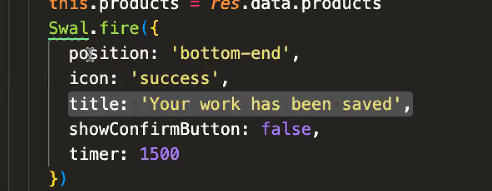
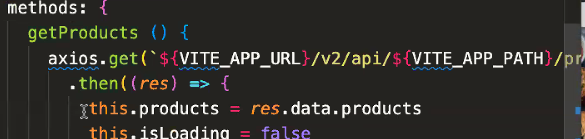

# 第六週(三)：Sweet Alert、Vue Loading 建環境 Vite

- 講義網址：https://hackmd.io/idWhEmemQzyfblBfsy6-Og?view
- Template：https://github.com/hexschool/vite-template 也可以用 bs5
- modal 也有彈跳視窗，但 sweetalert2 支援度比較高，例如有支援 promise
- 有時候不是 code 的問題，而是環境建置的問題
- 記得加上 env 環境變數檔案
- mounted：DOM 元素準備好了

## sweetalert2

`import Swal from 'sweetalert2'`
swal 為自訂名稱

`swal.fire('標題名稱')`

點擊按鈕後才觸發 swal 彈跳視窗

### 視窗 "確認" 按鈕

是否需要確認按鈕

- `showConfirmButton: true (false)`

按鈕顯示的文字

- `confirmButtonText: '確認'`

### 視窗 "不要" 按鈕

是否需要不要按鈕

- `showDenyButton: true (false)`

按鈕顯示的文字

- `denyButtonText: '確認'`

### icon 也有不同選擇

https://sweetalert2.github.io/#icons

## Vue Loading

https://github.com/ankurk91/vue-loading-overlay
https://kaychen1994.github.io/2020/08/30/vue-loading/

`import Loading from 'vue-loading-overlay'`

要載入 components 中

is-full-page 滿版效果
局部更新，is-full-page 改成 false，父層加 class="vl-parent"

要自己判斷 Loading 什麼時候關閉，例如：資料回傳後關閉

### Loading 效果客製化

小區塊 loading
https://loading.io/
https://getbootstrap.com/docs/5.2/components/spinners/
